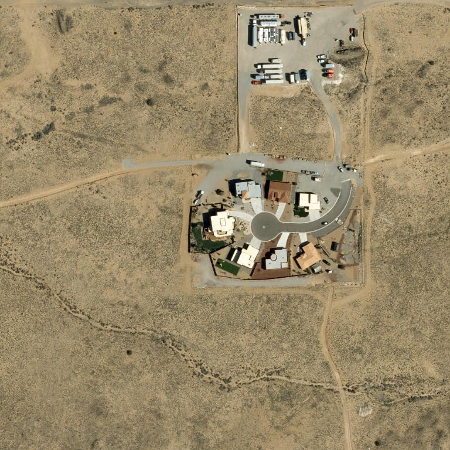

# 🛰️ Satellite Imagery Monitor

Automated weekly monitoring of satellite imagery for a *Pluribus* filming site.  
Location: **35°09'55.3"N 106°44'46.4"W**

## Newest change vs. previous

| 🆕 Newest — 2025-12-31 20:43:42 UTC | 🕒 Previous — 2025-12-31 20:27:03 UTC |
|:---:|:---:|
|  |  |

---

## History

All captures (newest first)

- **2025-12-31 20:43:42 UTC** — [`imagery_20251231_204342.jpg`](imagery_20251231_204342.jpg)
- **2025-12-31 20:27:03 UTC** — [`imagery_20251231_202703.jpg`](imagery_20251231_202703.jpg)
- **2025-12-31 20:22:32 UTC** — [`imagery_20251231_202232.jpg`](imagery_20251231_202232.jpg)
- **2025-12-31 20:20:45 UTC** — [`imagery_20251231_202045.jpg`](imagery_20251231_202045.jpg)
- **2025-12-31 20:18:20 UTC** — [`imagery_20251231_201820.jpg`](imagery_20251231_201820.jpg)
- **2025-12-31 20:04:23 UTC** — [`imagery_20251231_200423.jpg`](imagery_20251231_200423.jpg)
- **2025-12-31 19:48:19 UTC** — [`imagery_20251231_194819.jpg`](imagery_20251231_194819.jpg)

